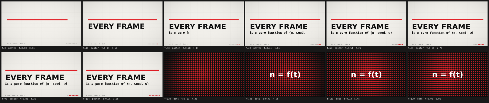

# code-animation-kit

> **English abstract.** A tiny toolkit for making animated short films *out of code*: one HTML file, one canvas, one
> `draw(t)`. Every frame is a pure function of `(frame number, seed, width)`; headless Chrome renders the frames,
> ffmpeg assembles them. No footage, no images, no CDN, no timeline editor.
>
> It ships a runnable engine skeleton, a frame renderer with multi-tab parallelism, a contact-sheet QA tool,
> a pure-Node chiptune synthesiser, and the methodology that decides whether the result looks *made* or *generated*.



上面这张就是 `assets/skeleton.html` 跑出来的：12 格拉片、6 秒、两段分镜（瑞士海报 + 半调网点溶解）。开箱即跑。

---

## 这是什么

2025 年底刷屏的"某某模型直出视频"，绝大多数不是视频生成——是模型写了一个会自己动的网页，再一帧一帧拍成视频。这个仓库把那套流程里**跟题材无关的部分**抽出来做成工具：

| 你会得到 | 你不会得到 |
|---|---|
| 一个能跑的引擎骨架（画布池 / 节拍网格 / 分镜系统 / 联系表 / 确定性随机） | 现成的画面。画面得你自己写 |
| 逐帧渲染器（多标签页并行）+ 编码脚本（BT.709 + faststart + 自动校验） | 剪辑、转场库、关键帧编辑器 |
| 纯 Node 合成配乐（方波主音 / 合成鼓 / 与画面共用节拍）的参考实现 | 采样音源、混音台、开箱即用的「配乐机」 |
| 一套决定"像人做的还是像模型默认吐的"的判据与拉片清单 | 风格模板。风格必须从题材反推 |

---

## 三步跑起来

```bash
npm i
npx puppeteer browsers install chrome     # WSL/Debian 还需要一堆 libnss3 之类的，见 docs/03-render.md

npm run shot -- 0 60 120                 # 只渲染 3 帧，先看清楚再往下走
npm run sheet                            # 24 格拉片 -> shots/sheet.png
npm run render && npm run build   # -> frames/ + out/film.mp4（6 秒演示片）
# 一行到底： npm run make

# 配乐是可选的。注意 audio.mjs 是「参考实现」：它写的是另一条 24 秒片子的乐谱，
# 直接跑会得到 24 秒音轨而骨架演示只有 6 秒，build.sh 会报警。
# 换片子要改 audio.mjs 顶部的 DUR 和 SEC_* 分节边界（见 docs/04-audio.md）。
npm run audio
```

浏览器里实时预览：直接打开 `assets/skeleton.html`。
URL 旋钮：`?f=90` 单帧 ｜ `?grid=12&cw=440` 拉片 ｜ `?s=12` 换种子 ｜ `?w=960` 换宽度 ｜ `?ar=9:16` 竖版。

---

## 工作流

```
① 问清楚        题材、时长、画幅、要不要配乐、给谁看
② 三个方案      不同风格方向 + 一张关键帧预览，让人类挑（别自己拍板）
③ brief.md      锁死：时长/帧数/节拍/调色板/四到六段分镜/每段一句话
④ 搭骨架        复制 assets/skeleton.html，改 FPS/BPM、填 PLATES
⑤ 逐段做        一段一段来：先静态构图 → 再做动画 → 每段跑 node shot.mjs 看静帧
⑥ 拉片自检      出 24 格拉片，照着 docs/05-qa.md 的清单逐条挑，改到挑不出为止
⑦ 渲染 + 编码   node render.mjs frames 7 && ./build.sh（自动校验帧数与时长）
```

**顺序不能省。** 我自己的经验：跳过 ② 直接开工，做出来的东西十有八九是"深海军蓝底 + 霓虹渐变 + 为了氛围的粒子"；跳过 ⑥ 直接渲染全片，720 帧要 3.5 分钟，而"这个字压在水纹上了"这种问题在第 1 帧的静帧里就能看出来。

---

## 盒子里有什么

```
assets/skeleton.html   引擎骨架（497 行，可跑，自带两段演示分镜）—— 一切的起点
assets/render.mjs      逐帧渲染器：无头 Chrome + 4 个标签页并行抢帧
assets/shot.mjs        只渲染指定几帧（迭代的主力，比全片快 200 倍）
assets/build.sh        ffmpeg 编码 + BT.709 打标 + 帧数/时长校验
assets/audio.mjs       纯 Node 合成配乐，零依赖，确定性（同种子同 md5）——**参考实现**，见下
SKILL.md               给 AI agent 的技能说明书（丢进 .agents/skills/ 就能用）
BRIEF.template.md      开工前填的 brief 模板
docs/00-principles.md  为什么每帧必须是纯函数，以及代价
docs/01-engine.md      引擎解剖 + 手把手加一个新分镜
docs/02-style.md       风格与约束：调色板、缓动、动画十二法、相机
docs/03-render.md      渲染与编码：参数、坑、性能量级
docs/04-audio.md       配乐：结构、节拍对齐、怎么改 BPM
docs/05-qa.md          拉片自检清单 + 常见病对照表
docs/research-notes.md 调研原始笔记（framewright / every-frame-is-code / xilo-opus-video）
```

---

## 引擎的三十秒版本

一个 HTML 文件里，九节按固定顺序排开，**辅助函数必须在分镜之上**（否则删掉一段镜头会把夹在中间的辅助函数一起删掉）：

```
参数 → 生成器 → 数学 → 画布池 → 调色板 → 辅助函数 → 引擎 → 分镜 → boot
```

三件事值得单独说：

**三个生成器，各管一个时间尺度。** 都掺进段落名，所以插入或删掉一段不会改变别的段的随机数：

```js
R    = rng(hash(seed,'plate',name))              // 整段稳定：构图、地形、浪的位置
S.b  = rng(hash(seed,'b',name,Math.floor(n/3)))  // 每 3 帧重掷：手绘线的"沸腾"抖动
S.nz = rng(hash(seed,'nz',n))                    // 每帧重掷：噪声场
```

**逻辑坐标固定短边 1080。** 场景只画逻辑坐标，引擎统一缩放到输出像素，`?w=960` 换宽度不用改一行构图代码。

**节拍即时间轴。** `FPS=30, BPM=120 → BEAT=15 帧`；每段长度取 BEAT 的整数倍；段内用局部帧 `S.i`，跨段对齐用全局帧 `S.f`，镜头之间不写死帧号而用 `at('dots',2)`。

```js
plate('dots',{len:BAR,cutIn:false,cutOut:false},(S,R)=>{ /* 画这一段的第 S.i 帧 */ });
```

细节、API 签名、以及"怎么加一个新分镜"在 [docs/01-engine.md](docs/01-engine.md)。

---

## 诚实的部分

- **它不生成画面。** 它让模型写代码画画面。画不出来的东西（流体、布料、写实材质）就是画不出来——真物理得按固定 dt 逐帧推，代价是不能 seek。
- **文字是强项，节奏是弱项。** 代码画字特别准；但"缓动够不够、镜头是不是该再短一点"这种判断，只能靠规则 + 拉片 + 人类看一眼。这套工具替不了人眼。
- **配乐是合成的，而且 `audio.mjs` 是"一部片子的配乐"的参考实现，不是通用配乐机。** 它是手写的加法合成 chiptune（动态范围约 14 dB，不是管弦），四段结构（drone / chiptune 律动 / 四踩推进 / 撞击收尾）是为那条 24 秒片子写的。换片子要改 `audio.mjs` 顶部的 `DUR` 和 `SEC_*` 分节边界，让它跟画面 plate 的边界对齐；`build.sh` 会检查音画时长是否一致并在不一致时报警。想清楚它"怎么写"比"直接拿来用"更值钱。
- **性能量级要心里有数，而且波动很大。** 1920×1080 单帧的耗时几乎全由逐像素后处理（`post()` 的颗粒 + 暗角）决定：关掉它 50–80ms/帧，开着 200–700ms/帧（同一台机器上，随着并行标签页数和系统负载能差三倍）。720 帧 @4 标签页实测 3.2–3.5 分钟。带双线性重采样的逐像素后处理可以到 0.5s/帧以上——**先把 `post()` 调好，再决定要不要全片重渲。**

---

## 出处

这套工具链的原理来自三个 MIT 开源项目，实现全部重写：

- [smwbev/framewright](https://github.com/smwbev/framewright) — 骨架结构、渲染脚本、编码参数、拉片自检
- [kiselas/every-frame-is-code](https://github.com/kiselas/every-frame-is-code) — 质量方法论、动画十二法在代码里的落地
- [Kianzzz/xilo-opus-video](https://github.com/Kianzzz/xilo-opus-video) — 中文流程：问需求 → 方案预览 → brief → 逐镜头静帧自检

用这套工具做出来的第一条片子（24 秒，四段风格）：**[turboegg1145/every-frame-is-a-function](https://github.com/turboegg1145/every-frame-is-a-function)** —— 那个仓库里的 README 写了我在做它的过程中踩的 8 个坑。

MIT License。
